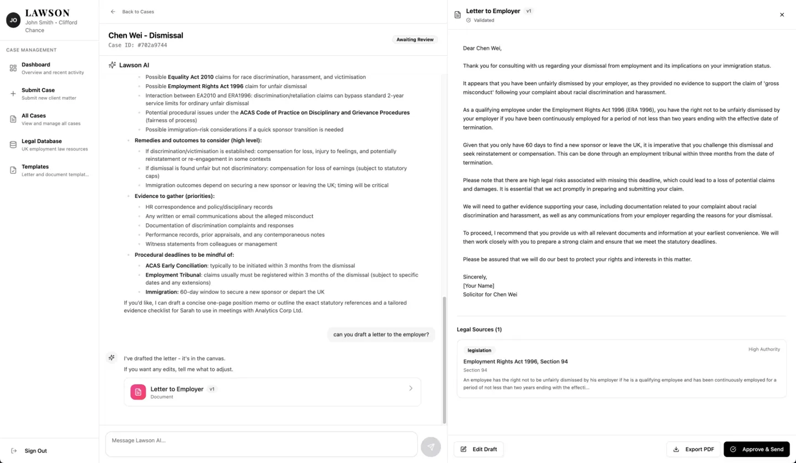
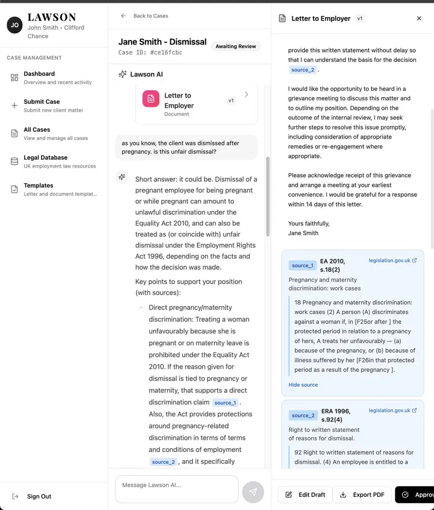

# GenAI Multi-Agent Platform - Architecture Case Study

> **Production system architecture** demonstrating multi-agent orchestration, RAG optimization with weighted re-ranking, LLM observability, and multi-tenant data isolation.

[](https://www.python.org/)
[](https://fastapi.tiangolo.com/)
[](https://langchain-ai.github.io/langgraph/)
[](https://qdrant.tech/)
[](https://openai.com/)
[](https://langfuse.com/)

---

## Overview

Architected and built a **production GenAI platform** for complex domain workflows requiring multi-step reasoning, dual-source knowledge retrieval, and automated document generation—with end-to-end observability and multi-tenant data isolation.

**System Context:** Domain-specific intelligent assistant (legal tech) handling case intake, analysis, knowledge, user requests, and document generation.

**Two AI Orchestration Patterns:**

1. **Multi-agent workflow (LangGraph)**: Specialized agents (classification, QA assessment, document generation) work in sequence, each handling a specific task. LangGraph orchestrates the handoffs and maintains state across agents.

2. **Tool-augmented AI assistant (Function calling)**: A single conversational agent dynamically selects from 7 tools based on user requests.

**Key Architecture Challenge:** Design a system that combines general statutory knowledge with organization-specific precedents, orchestrates multi-agent workflows reliably, and maintains complete tenant isolation—while keeping latency under 3 seconds and costs manageable.

---

## System in Action

### AI Assistant with Function Calling & Canvas UI


*Conversational AI interface with real-time SSE streaming, function calling transparency, and side-by-side document canvas. Left: AI analyzes case and suggests document generation. Right: Live document editor with version tracking.*

### RAG with Dual-Source Citations


*Dual-source RAG with weighted re-ranking: AI retrieves results from Qdrant vector database (both shared statutory collection and per-tenant organization collections), applies 1.5x boost to organization precedents, and displays citations with expandable source details. Vector search enables semantic retrieval beyond keyword matching.*

### Langfuse LLM Observability


*End-to-end LLM observability: Langfuse traces capture all AI operations including OpenAI chat completions (model, user messages, conversation length, response tokens), workflow agent executions (classification, QA assessment), function calls, and embeddings. Each trace includes input/output data, token counts, latency, and error states. Traces grouped by session ID for conversation-level analysis.*

---

## System Architecture

### High-Level Design

```
┌─────────────────────────────────────────────────────────────────┐
│                      Client Layer                                │
│         React SPA • Real-Time SSE Streaming • Canvas UI          │
└────────────────────────┬────────────────────────────────────────┘
                         │ REST API + Server-Sent Events
                         ▼
┌─────────────────────────────────────────────────────────────────┐
│                   API Gateway (FastAPI)                          │
│     Auth • Rate Limiting • Validation • Request Routing         │
└────────────────────────┬────────────────────────────────────────┘
                         │
         ┌───────────────┼───────────────┐
         │               │               │
         ▼               ▼               ▼
┌─────────────┐  ┌─────────────┐  ┌─────────────┐
│ Multi-Agent │  │ RAG Pipeline│  │ Observability│
│ Workflows   │  │ Dual-Source │  │ Layer        │
│             │  │ Weighted    │  │              │
│ LangGraph   │  │ Re-Ranking  │  │ Langfuse     │
│ StateGraph  │  │             │  │ Tracing      │
└──────┬──────┘  └──────┬──────┘  └──────┬───────┘
       │                │                │
       └────────────────┼────────────────┘
                        │
         ┌──────────────┼──────────────┐
         │              │              │
         ▼              ▼              ▼
┌─────────────┐  ┌─────────────┐  ┌──────────────┐
│ PostgreSQL  │  │   Qdrant    │  │  OpenAI API  │
│             │  │             │  │              │
│ Relational  │  │ Per-Tenant  │  │ GPT-4o       │
│ + JSONB     │  │ Collections │  │ Embeddings   │
│ tenant_id   │  │ Vector DB   │  │ Fn Calling   │
└─────────────┘  └─────────────┘  └──────────────┘
```

### Architecture Principles

**Domain-Driven Design**: Separation between business logic (domain layer), infrastructure (repositories, AI clients), and API boundaries. Domain services have no infrastructure dependencies.

**Multi-Tenant Isolation**:
- PostgreSQL: Row-level security via indexed `tenant_id` column
- Qdrant: Physical isolation via per-tenant collections (`firm_knowledge_{tenant_id}`)
- Repository factory pattern for tenant-scoped instantiation

**Observability-First**: Every AI operation instrumented with Langfuse (spans, traces, sessions, token tracking). Critical for debugging LLM behavior and cost attribution.

**Resilience by Design**: LangGraph checkpointing, exponential backoff retries, circuit breakers, connection pooling, graceful degradation.

---

## Core Technical Components

### 1. Multi-Agent Workflow Orchestration (LangGraph)

**Architecture Decision**: Use LangGraph StateGraph over alternatives (Temporal, Airflow, custom code).

**Implementation**:
- **4-node directed graph**: `intake → classify → qa_assess → create_case`
- **TypedDict state**: Type-safe state transitions with validation
- **MemorySaver checkpointing**: Persistent state after each node
- **Conditional routing**: Error handling via state-based edge selection

**Code Reference**: `backend/core/workflow/case_workflow.py`

**Key Innovation**: Checkpointing enables workflow recovery from transient failures (API timeouts, DB deadlocks) by resuming from last successful step rather than restarting entire workflow.

**Technical Trade-off**: Increased memory for state storage vs. fault tolerance. Chose fault tolerance for production reliability.

---

### 2. RAG Pipeline with Weighted Re-Ranking

**Problem**: System needs to search **two distinct knowledge sources**:
1. **Statutory knowledge**: Universal domain laws/regulations (shared)
2. **Organization knowledge**: Internal precedents, templates (tenant-isolated)

Standard approaches (single source or naive merging) fail to prioritize organization-specific content, which users prefer.

**Solution**: Dual-source RAG with weighted re-ranking.

#### Ingestion Architecture

```
Document Upload
      ↓
Text Extraction (PyPDF2/pdfplumber/Tesseract OCR)
      ↓
Semantic Chunking (800 tokens, 100 overlap)
      ↓
Embedding Generation (OpenAI ada-002, 1536D)
      ↓
Vector Storage (Qdrant per-tenant collection)
      ↓
Metadata Storage (PostgreSQL)
```

**Semantic Chunking Strategy** (`backend/infrastructure/document/chunking_strategy.py`):
- **Section-aware**: Detect headers via regex (Markdown, numbered sections, ALL-CAPS)
- **Sentence-level splitting**: Preserve semantic boundaries (no mid-sentence cuts)
- **Configurable overlap**: 100 tokens overlap prevents context loss at boundaries
- **Metadata preservation**: Section titles, character positions, token counts

**Configuration**:
```python
chunk_size: int = 800       # Optimal for embedding models
chunk_overlap: int = 100    # Context continuity
min_chunk_size: int = 200   # Avoid trivial fragments
```

#### Retrieval with Weighted Re-Ranking

**Strategy** (`backend/domain/assistant/service.py:414-544`):

1. **Parallel search** both sources (over-fetch 2x limit)
2. **Apply weighted scoring**:
   - Statutory: `score × 1.0` (baseline)
   - Organization: `score × 1.5` (prioritize)
3. **Global re-ranking** by weighted score
4. **Top-K selection** across all candidates

**Code**:
```python
# Statutory sources: 1.0x weight
weighted_source["weighted_score"] = original_score * 1.0

# Organization sources: 1.5x boost
weighted_source["weighted_score"] = original_score * 1.5

# Re-rank globally
combined_sources.sort(key=lambda x: x["weighted_score"], reverse=True)
```

**Why This Works**:
- Simple hyperparameter (no training required)
- Preserves semantic relevance
- Explainable to users
- Globally optimal ranking

**Technical Trade-off**: Over-fetching adds latency (~60ms) vs. improved relevance. Chose relevance.

**Alternative Approaches Rejected**:
- Separate searches (2 API calls): Slower, no unified ranking
- Metadata filtering: Binary (include/exclude), not prioritization
- Fine-tuned embeddings: Expensive, ongoing maintenance
- Query rewriting: Adds latency, unpredictable

---

### 3. LLM Observability with Langfuse

**Architecture**: Custom observability layer wrapping all AI operations.

**Implementation** (`backend/core/observability/langfuse_tracer.py`):
- **Span-based tracing**: Wrap each operation (chat, embedding, function call, workflow step)
- **Nested traces**: Parent trace for conversation, child spans for operations
- **Session grouping**: All traces for entity grouped by ID (e.g., `case_id`)
- **Metadata capture**: Model, token counts, latency, error messages

**Instrumented Operations**:
```python
# Workflow steps
tracer.trace_agent_call(
    agent_name="workflow_step_classify",
    input_data={"step": "classify"},
    output_data=classification_result,
    duration_ms=duration
)

# OpenAI calls
openai_span = tracer.create_span(
    name="openai_chat",
    input_data={"model": "gpt-4o", "user_message": message},
    metadata={"conversation_length": len(history)}
)
```

**Use Cases Enabled**:
- Debug AI decision-making (trace replay)
- Latency breakdown by operation
- Cost attribution by feature/user
- Token usage optimization
- Error root-cause analysis

---

### 4. Multi-Tenant Data Architecture

**Challenge**: Complete data isolation across organizations without performance degradation.

#### PostgreSQL Strategy (Shared Schema, Row-Level Isolation)

**Design**:
```python
class Case(Base):
    id = Column(String, primary_key=True)
    tenant_id = Column(String, nullable=False, index=True)  # Indexed
    # ... other fields
    classification = Column(JSON)  # JSONB for AI results
```

**Query Pattern**:
```python
# All queries auto-filtered by tenant_id at repository layer
cases = db.query(Case).filter(Case.tenant_id == firm_id).all()
```

**Advantages**:
- • Cost-efficient (single database)
- • Fast queries (indexed tenant_id)
- • JSONB for unstructured AI outputs (no schema migrations)

**Risks & Mitigations**:
- • Application-level enforcement (no DB-level RLS)
- • Mitigated: Repository pattern encapsulation, integration tests, query auditing

#### Qdrant Strategy (Physical Isolation)

**Design**:
```python
collection_name = f"firm_knowledge_{tenant_id}"

# Per-tenant repository instantiation
repo = QdrantDocumentRepository(
    firm_id=tenant_id,
    qdrant_client=client,
    ...
)
```

**Collection Examples**:
- `legal_knowledge_v2` (shared statutory knowledge)
- `firm_knowledge_acme_law` (Acme Law's precedents)
- `firm_knowledge_smith_partners` (Smith & Partners' documents)

**Advantages**:
- • Complete isolation (impossible to cross-query)
- • No filtering logic (simpler, safer code)
- • Easy tenant deletion (drop collection)
- • Independent scaling per tenant

**Trade-offs**:
- • More collections to manage (monitoring, backups)
- • Collection creation latency on first upload (~5s)
- • Acceptable for expected scale (<100 tenants)

**Decision Rationale**: Physical isolation in Qdrant chosen over logical filtering for security simplicity, even though it trades off operational complexity. For vector data, isolation benefits >> management costs.

---

### 5. OpenAI Function Calling Orchestration

**Architecture**: 7-tool function calling system with focused responsibilities.

**Tool Registry** (`backend/domain/assistant/function_registry.py`):

1. **search_legal_knowledge**: Dual-source search with weighted re-ranking
2. **generate_letter_to_employer**: Trigger document generation workflow
3. **update_document**: AI-assisted document editing
4. **analyze_case_timeline**: Extract key dates, deadlines
5. **assess_case_risks**: Risk analysis with severity scoring
6. **execute_workflow**: Trigger arbitrary workflow templates
7. **list_workflows**: Enumerate available workflows

**Design Decisions**:

**Tool Granularity**: Focused tools over monolithic functions
- Rationale: Easier for AI to select correct tool, simpler signatures
- Trade-off: More tools to maintain vs. AI accuracy
- Choice: Optimized for AI accuracy

**Result Formatting**: Return summaries, not full outputs
```python
# • Naive approach (wastes context window)
return {"document": full_3_page_letter}

# • Optimized approach
return {"success": True, "message": "Document generated"}
# Stream actual document via SSE separately
```
- Impact: ~40% token reduction in function call overhead

**Error Handling**: Graceful degradation
```python
# Return structured errors, not exceptions
return {"success": False, "error": "Search service timeout"}

# AI can adapt response
if result.success:
    # Use full data
else:
    # Explain limitation to user
```

**Why This Matters**: Function calling success depends on clear descriptions. Tool descriptions include:
- When to use (context)
- What it returns (format)
- Example use cases

---

### 6. Server-Sent Events (SSE) Streaming

**Problem**: Long AI responses (5-15s) feel unresponsive with request/response pattern.

**Solution**: Real-time streaming via SSE.

**Event Types**:
- `text`: Token-by-token response
- `thinking`: Extended reasoning (GPT reasoning mode)
- `function_call_start`: Tool being invoked
- `function_result`: Tool execution complete
- `canvas_open`: Open document editor
- `document_stream`: Progressive document rendering
- `legal_sources`: Display retrieved citations
- `error`: Graceful error handling

**Architecture**:
```python
@router.post("/chat/stream")
async def chat_stream():
    async def event_generator():
        async for event in assistant_service.chat_stream(...):
            yield f"data: {json.dumps(event)}\n\n"

    return StreamingResponse(
        event_generator(),
        media_type="text/event-stream"
    )
```

**Benefits**:
- **Progressive rendering**: Response builds in real-time
- **Function transparency**: Users see AI tool usage
- **Perceived performance**: Engagement starts at first token (~500ms) vs waiting for full response
- **Graceful errors**: Partial results shown even on failure

**Technical Trade-off**: SSE requires maintaining open connections (server capacity). Mitigations:
- Async FastAPI workers (100+ concurrent streams tested)
- Automatic timeout (5 min max)
- Connection pooling (prevents DB exhaustion)

---

## Technical Challenges & Solutions

### Challenge 1: Organization Context Prioritization

**Problem**: Vector search returns semantically relevant results but doesn't prioritize source type. Organization-specific precedents (more valuable to users) ranked same as generic statutory content.

**Attempted Solutions**:
1. • Separate searches (slow, no unified ranking)
2. • Metadata filtering (binary, not prioritization)
3. • Fine-tuned embeddings (expensive, maintenance)
4. • **Weighted re-ranking**

**Why Weighted Re-Ranking Won**:
- Single hyperparameter (1.5x boost)
- No training/fine-tuning required
- Preserves semantic relevance
- Explainable to stakeholders
- Tunable via A/B testing

**Implementation**: Over-fetch candidates, apply weights, global re-ranking.

---

### Challenge 2: Workflow Fault Tolerance

**Problem**: Multi-step workflows failed at high rate due to transient errors (API timeouts, DB deadlocks). Naive retry meant re-executing all steps (wasteful, slow).

**Solution**: LangGraph MemorySaver checkpointing.

**Why This Works**:
- Framework-native (no external dependencies)
- Automatic state serialization
- Resume from any step
- Minimal code changes

**Alternative**: External workflow engine (Temporal) rejected due to operational overhead for use case complexity.

---

### Challenge 3: Multi-Tenant Vector Isolation

**Problem**: Qdrant has no built-in multi-tenancy. How to prevent cross-tenant data leakage?

**Evaluated Approaches**:
| Approach | Security | Simplicity | Ops Overhead |
|----------|----------|------------|--------------|
| Metadata filtering | • Medium | • Complex | • Low |
| Shared collection | • Risk | • Medium | • Low |
| Per-tenant instances | • High | • Simple | • High |
| Per-tenant collections | • High | • Simple | • Medium |

**Decision**: Per-tenant collections.

**Rationale**:
- Physical isolation (zero risk)
- No filtering logic (no bugs)
- Acceptable ops overhead for scale (<100 tenants expected)
- Simple tenant deletion (drop collection)

---

### Challenge 4: Token Cost Management

**Problem**: Naive implementation sent full context every request, causing linear scaling: 10x users = 10x costs.

**Optimizations Applied**:
1. **Prompt compression**: Reduce system prompt tokens
2. **Chunk size tuning**: Optimize 1000 → 800 tokens (better quality + less overlap)
3. **Function result summarization**: Return summaries, not full documents (~40% reduction)
4. **Context window pruning**: Send last N turns, not full history

**Key Insight**: Token optimization is **architectural**, not just prompt engineering. Function result formatting had larger impact than prompt compression.

**Result**: Sub-linear cost scaling with user growth.

---

### Challenge 5: Domain Document Chunking

**Problem**: Legal/medical/financial documents have hierarchical structure (sections, subsections, numbered lists). Fixed-size chunking breaks context.

**Naive Approach**:
```python
chunks = [text[i:i+1000] for i in range(0, len(text), 1000)]
```
Result: Poor retrieval relevance, mid-sentence cuts, lost section context.

**Solution**: Section-aware semantic chunking.

**Strategy**:
- Detect headers via regex
- Group content by section
- Split at sentence boundaries
- Overlap at chunk boundaries (not section boundaries)

**Impact**: Significant retrieval quality improvement vs fixed-size chunking.

---

## Technology Stack Rationale

**LangGraph**: Chosen for AI-native state machine abstractions, built-in checkpointing (critical for workflow reliability), conditional routing, and low operational overhead. Rejected Temporal (too heavyweight, high ops burden) and custom implementation (would require manual checkpointing and state management).

**Qdrant**: Selected for self-hosted option (cost control, data sovereignty), fast search performance (<100ms typical), per-tenant collections pattern (clean isolation), and excellent Python client. Rejected Pinecone (cloud-only, namespace-based multi-tenancy) and pgvector (slower for high-dimensional search).

**Langfuse**: Selected for LLM-specific observability (traces, tokens, sessions), session-based analytics for conversation grouping, self-hosted option, and sufficient free tier. Rejected LangSmith (cloud-only, vendor lock-in) and W&B (generic ML tooling, not LLM-optimized).

---

## Key Learnings

### 1. Weighted Re-Ranking > Multiple Searches

**Insight**: Don't make 2 sequential API calls and merge. Over-fetch in parallel and re-rank globally.

**Impact**: ~50% latency reduction (serial → parallel) + improved relevance

---

### 2. Checkpointing Pays Dividend

**Insight**: Transient failure recovery is critical for multi-step workflows.

**Approach**: LangGraph MemorySaver provides this with minimal code.

**ROI**: Significant reliability improvement with small implementation effort.

---

### 3. Multi-Tenancy is Day-1 Concern

**Insight**: "Add filtering later" becomes "retrofitting is 10x harder."

**Lesson**: Design tenant isolation from start. Per-tenant collections in Qdrant = security by design.

---

### 4. Token Optimization is Architectural

**Insight**: Naive context management = linear cost scaling.

**Solution**: Architectural patterns (summarization, context pruning, chunk tuning) = sub-linear scaling.

---

### 5. Domain-Specific Chunking is Critical

**Insight**: Off-the-shelf chunking (character/token count) fails for structured documents.

**Solution**: Custom chunking with section awareness, sentence boundaries.

**Impact**: Largest single improvement in retrieval quality.

---

### 6. Observability Enables Optimization

**Insight**: Can't optimize what you can't measure.

**Example**: Langfuse traces revealed function call token overhead → led to result summarization → significant cost reduction.

---

### 7. Streaming is UX Game-Changer

**Insight**: Perceived latency > actual latency.

**Data**: Progressive rendering (SSE) feels faster than wait-for-complete, even if total time is longer.

---

## What This Demonstrates

### AI Infrastructure & MLOps

• Multi-agent orchestration with fault tolerance (LangGraph checkpointing)
• Production RAG with custom retrieval strategy (weighted re-ranking)
• LLM observability for debugging and cost management (Langfuse)
• Prompt engineering for function calling reliability

### Data Platform Architecture

• Multi-tenant data isolation (PostgreSQL + Qdrant)
• Vector database optimization (semantic chunking, collection strategy)
• Real-time streaming (SSE async processing)
• Cost-efficient architecture (sub-linear token scaling)

### System Design

• Domain-driven design (clean architecture, repository pattern)
• Technology evaluation (decision matrices, trade-off analysis)
• Production engineering (reliability, performance, observability)
• Scalability patterns (connection pooling, async operations)

---

## Documentation

- **[ARCHITECTURE.md](./ARCHITECTURE.md)**: Detailed technical diagrams and implementation patterns

---

## About This Project

This case study documents a **production GenAI platform** I architected and built. The project demonstrates:

- **AI Infrastructure**: Multi-agent orchestration, RAG optimization, LLM observability
- **MLOps**: Production monitoring, cost optimization, reliability engineering
- **Data Platforms**: Multi-tenant architecture, vector databases, real-time streaming
- **System Design**: Clean architecture, technology evaluation, production patterns

**Tech Stack**: Python 3.11, FastAPI, LangGraph, Qdrant, OpenAI, Langfuse, PostgreSQL, Docker

**Focus**: GenAI system architecture, not implementation details. Demonstrates technical decision-making, trade-off analysis, and production engineering principles.

---

**Last Updated**: February 2025
